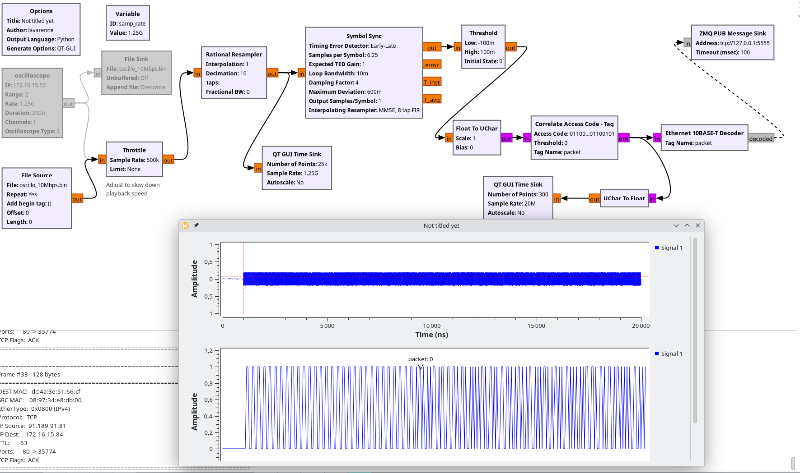
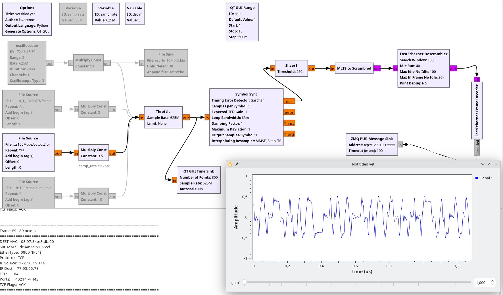
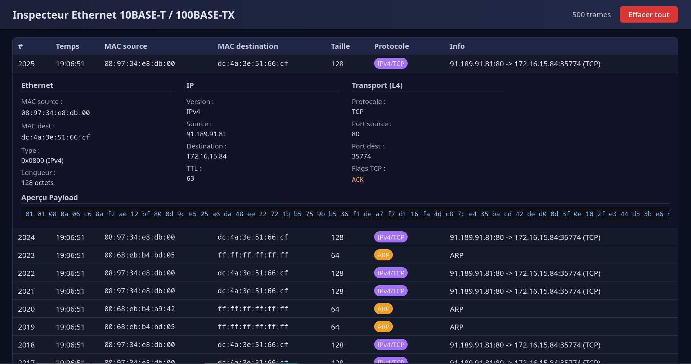

# gr-ethernet

GNU Radio blocks for Ethernet physical layer signal processing and frame decoding.

Supports both 10BASE-T (Manchester encoding) and 100BASE-TX (MLT-3 encoding) standards with full protocol stack decoding up to Layer 4.

This work follows the article "Ethernet à la loupe: de la couche physique au décodage des trames" published in Hackable Magazine #61 (Juillet - Aout 2025).

## Features

### Signal Processing Blocks

**100BASE-TX (Fast Ethernet)**
- **Slicer3**: 3-level slicer for MLT-3 signals
- **MLT3 to Scrambled**: Converts MLT-3 symbols to scrambled bits (transition detection)
- **FastEthernet Descrambler**: Automatic synchronization and descrambling with adaptive re-sync
- **FastEthernet Frame Decoder**: Complete frame decoder with 5B/4B decoding

**10BASE-T (Ethernet)**
- **Ethernet 10BASE-T Decoder**: Manchester-encoded frame decoder


## Screenshots

### Web Inspector


### 100BASE-TX Flowgraph


### Decoded Frames Example



### Decoded Information

Each frame provides:
- Source and destination MAC addresses
- EtherType and protocol identification
- VLAN ID, PCP, and DEI (when present)
- IP source and destination addresses (IPv4/IPv6)
- TTL/Hop Limit
- Protocol type (TCP/UDP/ICMP)
- Source and destination ports
- TCP flags (SYN, ACK, FIN, RST, PSH, URG)
- ICMP type and code
- Payload preview (first 64 bytes in hexadecimal)
- Frame length

Output format: PMT dictionary messages via GNU Radio message ports

## Installation

### Prerequisites
```bash
# Arch/Manjaro
sudo pacman -S gnuradio gnuradio-companion cmake boost pybind11

# Debian/Ubuntu
sudo apt install gnuradio gnuradio-dev cmake libboost-all-dev pybind11-dev
```

### Build and Install
```bash
git clone https://github.com/tlavarenne/gr-ethernet.git
cd gr-ethernet
mkdir build
cd build
cmake -DCMAKE_INSTALL_PREFIX=/usr ..
make -j$(nproc)
sudo make install
sudo ldconfig
```

### Verify Installation
```bash
python3 -c "from gnuradio import ethernet; print('gr-ethernet loaded successfully')"
gnuradio-companion  # Blocks should appear in [Ethernet] category
```

### Real-time Oscilloscope Acquisition (Optional)

For real-time signal acquisition from supported oscilloscopes, install gr-oscillo by Jean-Michel Friedt:
```bash
git clone https://github.com/jmfriedt/gr-oscillo.git
cd gr-oscillo
mkdir build
cd build
cmake -DCMAKE_INSTALL_PREFIX=/usr ..
make -j$(nproc)
sudo make install
sudo ldconfig
```

Special thanks to Jean-Michel Friedt for gr-oscillo.

## Usage

### Example Flowgraphs

Two complete example flowgraphs are provided in the `examples/` directory with sample acquisition files:

**100BASE-TX Decoding**
- Flowgraph: `decode_100BASETX.grc`
- Sample files:
  - `output.bin` (sample rate: 625 MS/s)
  - `output2.bin` (sample rate: 625 MS/s)  
  - `RefCurve_2025-04-10_1_132807.Wfm.bin` (sample rate: 500 MS/s)

**10BASE-T Decoding**
- Flowgraph: `decode_10BASET.grc`
- Sample file: `oscillo_10Mbps.bin` (sample rate: 1.25 GS/s)

The sample binary files contain float32 data captured from oscilloscopes monitoring Ethernet differential pairs.


### Web Inspector

Real-time web interface for monitoring decoded frames:
```bash
python3 apps/ethernet_inspector.py
```

Open http://127.0.0.1:5000 in your browser to view captured frames with full protocol details.

Requirements:
```bash
python3-flask python3-pyzmq
```

The web inspector expects ZMQ messages at `tcp://127.0.0.1:5555`. Add a ZMQ PUB Message Sink block in your flowgraph connected to the decoder's message output.

## Block Parameters

### Slicer3
- **threshold** (float, default: 0.25): Slicing threshold for 3-level decision

### FastEthernet Descrambler
- **search_window** (int, default: 50): Window size for initial state search
- **idle_run** (int, default: 40): Minimum consecutive 1s to detect IDLE pattern
- **max_idle_no_idle** (int, default: 100): Max bits without IDLE before losing sync (idle mode)
- **max_in_frame_no_idle** (int, default: 20000): Max bits without IDLE during frame reception
- **print_debug** (bool, default: False): Enable console debug output

### Ethernet 10BASE-T Decoder
- **tag_name** (string, default: "packet"): Stream tag name to trigger frame processing

## Technical Details

### 100BASE-TX Processing Chain

1. **MLT-3 Encoding**: Three-level signaling (-1, 0, +1) at 125 MBaud
2. **NRZI Conversion**: Transition = 1, No transition = 0
3. **Scrambling**: LFSR-based descrambling (polynomial x^11 + x^9 + 1)
4. **5B/4B Decoding**: Maps 5-bit code groups to 4-bit data
5. **Frame Extraction**: Detects /J/K/ (SFD) and /T/R/ (EOP) delimiters

### 10BASE-T Processing Chain

1. **Manchester Decoding**: Transition detection (01 = 1, 10 = 0)
2. **Frame Extraction**: Based on stream tags indicating packet boundaries

### Recommended Oscilloscope Settings

**100BASE-TX:**
- Sample rate: 500 MS/s - 1 GS/s
- Bandwidth: 200 MHz minimum
- Probe: Differential or single-ended on twisted pair

**10BASE-T:**
- Sample rate: 100 MS/s - 1.25 GS/s
- Bandwidth: 50 MHz minimum
- Probe: Differential or single-ended on twisted pair

The provided examples use data captured via crosstalk monitoring on adjacent twisted pairs, as described in Hackable Magazine #61.


## Troubleshooting

### No frames decoded (100BASE-TX)

- Check signal amplitude (use Multiply Const before Slicer3, typical values: 5-15)
- Verify Symbol Sync convergence (use QT GUI Time Sink)
- Try adjusting Slicer3 threshold (typical range: 0.2-0.5)
- Enable debug output in FastEthernet Descrambler

### Frames decoded too fast

- Add Throttle block after File Source
- Recommended throttle rate: 500k-10M samples/sec for comfortable viewing
- Lower values give more time to observe each frame


## License

GNU General Public License v3.0

## Author

Thomas Lavarenne

## Acknowledgments

- **Jean-Michel Friedt**: For gr-oscillo module
- **Hackable Magazine #61** "Ethernet à la loupe: de la couche physique au décodage des trames" 
- GNU Radio community for the excellent framework

## References

- gr-oscillo: https://github.com/jmfriedt/gr-oscillo


Built for educational purposes in the context of BTS CIEL (Cybersécurité, Informatique et Réseaux, Électronique)
